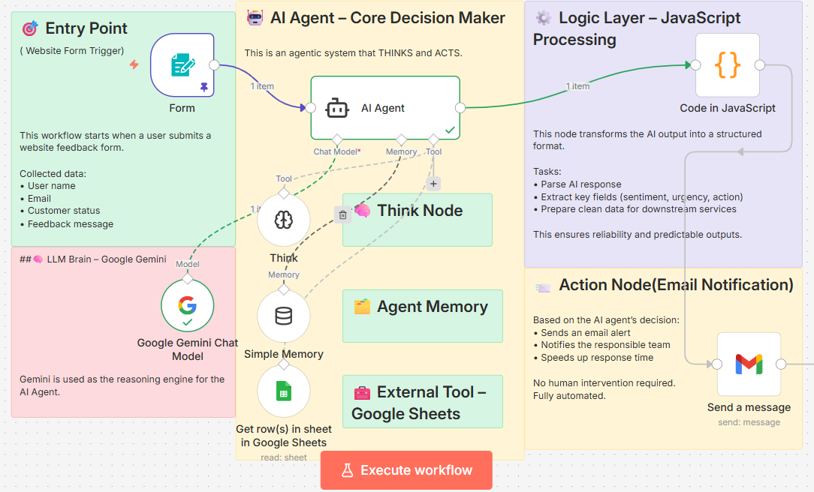

# 🤖 Feedback AI Automation System (n8n)

An autonomous, production-ready AI workflow built with **n8n** to analyze website feedback and take intelligent actions automatically.

This is not a chatbot.  
This is an **agentic AI system**.

---

## 🧩 What This Workflow Does

This workflow automatically:

• Receives website feedback via a form  
• Thinks step-by-step using an AI Agent  
• Analyzes sentiment and intent  
• Decides the next action autonomously  
• Sends emails and notifications without human input  

---

## 🖼️ Workflow Overview



---

## ⚙️ Workflow Components

• **Form Trigger** – Entry point for user feedback  
• **AI Agent + Think Node** – Core reasoning and decision-making  
• **Google Gemini** – Language model for analysis  
• **JavaScript Logic Node** – Output normalization and validation  
• **Filter Node** – Sentiment-based branching  
• **Gmail & Slack** – Automated notifications  

---

## 🧠 Technologies Used

- n8n
- Google Gemini
- AI Agent + Think Node
- JavaScript (Logic Node)
- Webhooks
- Gmail
- Slack
- Google Sheets (optional / extensible)

---

## 📦 How to Use

1. Download the workflow JSON file  
2. Import it into your n8n instance  
3. Configure API credentials (Gemini, Gmail, Slack)  
4. Activate the workflow  

That’s it. 🚀

---

## 🌍 Use Cases

- SaaS customer feedback automation  
- Website contact form processing  
- Customer support triage  
- Sentiment-based alerting systems  

---

## ⭐ Why This Matters

Most people use AI to chat.  
This workflow uses AI to **think and act**.

It replaces manual feedback review with autonomous decision-making.

---

## 📁 Files in This Repository

```text
.
├── feedback-ai-automation.json
├── workflow.png
└── README.md
